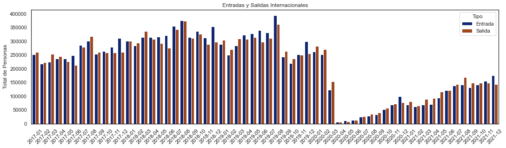
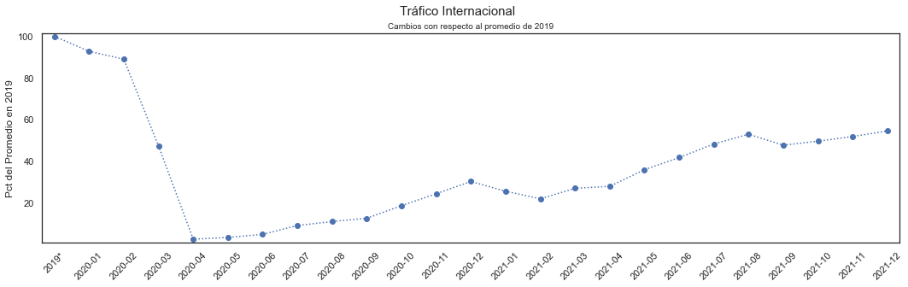
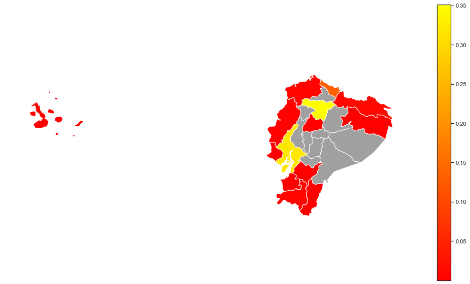

# ESI: Entradas y Salidas Internacionales
Data was collected by the migration office of Ecuador and published by the National Institute of Statistics and Census. The data will be also be shared in cleaned csv by the Data Hub of the Universidad San Francisco de Quito. The Data Hub is pioneering center for the collection, processing and presentation of data based in the city of Quito, Ecuador. This notebook brefly presents the data set and its main components. The datasets are originally avaiable in the site of [INEC](https://www.ecuadorencifras.gob.ec/entradas-y-salidas-internacionales/).


```python
import pandas as pd
import numpy as np
import matplotlib.pyplot as plt
import seaborn as sns
import os 
import glob
import plotly.graph_objects as g_o
import geopandas as gpd
from shapely.geometry import Point

sns.set(rc={'figure.figsize':(18, 4.5)})
sns.set_style("white")
pd.options.display.max_columns = 100

```


```python
file_paths = glob.glob(os.path.join('c:/Users/Elias/Desktop/GitHub/d-hub/data/esi/files/', '*.csv'))

dfs = []

for file_path in file_paths:
    df = pd.read_csv(file_path)
    dfs.append(df)

df = pd.concat(dfs, ignore_index=True)
```

    C:\Users\Elias\AppData\Local\Temp\ipykernel_34588\1984898972.py:6: DtypeWarning: Columns (6) have mixed types. Specify dtype option on import or set low_memory=False.
      df = pd.read_csv(file_path)
    

The data register each new person coming into Ecuador or leaving the country. The file as presented by INEC is disaggregated and presented in daily frequency basis. There are many variable that may give more insights about seasonality of international movements; the countries with which there are more and stronger connections; recovery in international movements after the impact of COVID-19. As a starting point it is possible to display how, on aggregate, international travelling has changed during the past 5 years.\
In the example below I aggregate the data to monthly frequency and plot the total amount of people entering and exiting the country for the whole time lapse covered in the data. Upon inspection one can notice the month of July is the one that exhibits the most traffic during the years 2017, 2018, 2019 as it could be expected since it is the time many people around the globe go to vacation.


```python
# define categories for `tip_movi` (type of movement) variable
df['tip_movi_fll'] = 0
df.loc[df['tip_movi'] == 1, 'tip_movi_fll'] = 'Entrada'
df.loc[df['tip_movi'] == 2, 'tip_movi_fll'] = 'Salida'

# plotting function
def plot_barchart(df):
    _ = sns.barplot(x=df['date'], y=df['count'], hue=df['tip_movi_fll'], palette='dark')
    _ = plt.title('Entradas y Salidas Internacionales')
    _ = plt.ylabel('Total de Personas')
    _ = plt.xlabel('')
    _ = plt.xticks(rotation = 45) 
    _ = plt.legend(title='Tipo')


(df.groupby(['date','tip_movi_fll'])
   .agg({'count':'sum'})
   .reset_index()
   .pipe(plot_barchart)
)
```


    

    


Of course, any pattern in the number of out- or incoming people is suddenly interrupted in 2020. During february, although movement restriction had not yet been implement in the country, the total amount of traffic (entries and exits combined) was already down by 50% with respect to the average value of 2019. Once the restrictions were in place, that same statistic fell by 99%, again with respect to the 2019 average.


```python
# calculate average entry and exit statistics for 2019 (exclusive at lower tail, inclusive at upper tail)

avg_2019 = (df.loc[(df['date'] >= '2018-12-31') & (df['date'] < '2019-12-31'), ]
              .groupby(['date'])
              .agg({'count':'sum'})
              .apply(lambda x: np.mean(x))
              .values
            )

# define plottig function
def plot_movi_index(df):
   _ = plt.plot(df['date'], df['count'], marker='o', linestyle=':')
   _ = plt.suptitle('Tráfico Internacional', fontsize=15)
   _ = plt.title('Cambios con respecto al promedio de 2019', fontsize = 10)
   _ = plt.ylabel('Pct del Promedio en 2019')
   _ = plt.xlabel('')
   _ = plt.xticks(rotation = 45)
   _ = plt.margins(0.015, 0.015)


(df.loc[df['date'] >='2019-11-31',]
   .groupby(['date'])
   .agg({'count':'sum'})
   .reset_index()
   .replace({'2019-12': '2019*', 553781: avg_2019})
   .assign(count=lambda x: (x['count'] / avg_2019) * 100)
   .pipe(plot_movi_index)
)
```


    

    


The evolution of travel seen with another perspective.


```python

mini = (
#     df.loc[df['date'] < '2019-12-31']
   df.groupby(['date'])
   .agg({'count':'sum'})
   .reset_index()
   .assign(month = lambda x: pd.DatetimeIndex(x['date']).month_name(),
           year = lambda x: pd.DatetimeIndex(x['date']).year)
)

palette = list(sns.color_palette(palette='husl', n_colors=5).as_hex())

fig = g_o.Figure()

for year, color in zip([2017, 2018, 2019, 2020, 2021], palette):

        fig.add_trace(g_o.Scatterpolar(
        r = mini.loc[mini['year'] == year, 'count'],
        theta = mini['month'],
        fill = None,
        name = year,
        marker = dict(color = color)
        ))

fig.update_layout(
        polar = dict(radialaxis = dict(visible = True),
                               angularaxis = dict(rotation=90)),
        showlegend=True,
        width = 720,
        height = 720,
        font = dict(size=14)
)

fig.show()
```


Another possibility offered by the data is the visualization of maps.


```python
maps = gpd.read_file('zip://./files_support/states_provinces.zip')

maps = maps.loc[maps['iso_a2'] == 'EC',]
```


```python
can_jefm = (df.loc[(df['date'] > '2018-12-31') & (df['date'] <= '2019-12-31')]
              .groupby(['can_jefm', 'lat_can_jefm', 'lng_can_jefm'])
              .agg({'count':'sum'})
              .assign(count = lambda d: d['count']/d['count'].sum())
              .reset_index())

can_jefm.loc[can_jefm['can_jefm'] == '901', 'lng_can_jefm'] = -79.9533

can_jefm['geometry'] = can_jefm.apply(lambda d: Point(d['lng_can_jefm'], d['lat_can_jefm']), axis = 1)

can_jefm = gpd.GeoDataFrame(can_jefm, crs='epsg:4326')
```

    c:\Users\Elias\anaconda3\envs\spatial_analysis\lib\site-packages\pandas\core\dtypes\cast.py:122: ShapelyDeprecationWarning:
    
    The array interface is deprecated and will no longer work in Shapely 2.0. Convert the '.coords' to a numpy array instead.
    
    


```python
can_jefm_maps = gpd.sjoin(maps, can_jefm, op = 'intersects')

ax = maps.plot(color = '#A0A0A0')
_ = can_jefm_maps.plot(ax=ax, column='count', cmap = 'autumn', legend = 'True')
_ = ax.set_axis_off()
```


    

    


```python
df['can_jefm'].unique()
```


    array(['901', '1701', '501', '801', '1308', 'San Lorenzo de Esmeraldas',
           '701', '2403', '707', '401', 'Nueva Loja', '1108', 'Loja',
           'Zamora', 'Puerto Francisco de Orellana',
           'Puerto Baquerizo Moreno', '2003', '101', 'Tena',
           'Puerto Villamil', 'Santa Rosa'], dtype=object)


```python

```
